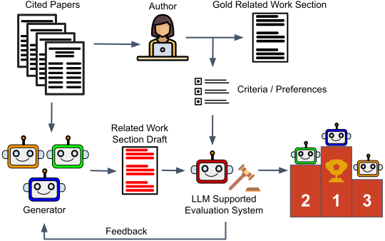

# Expert Preference-based Evaluation of Automated Related Work Generation
[](https://put-here-your-paper.com)
[](https://opensource.org/licenses/Apache-2.0)
[](https://www.python.org/)

<p align="center">
  
<p align="center">

This repository contains code and resources related to the paper "[Expert Preference-based Evaluation of Automated Related Work Generation]()".

> **Abstract:** Expert domain writing, such as scientific writing, typically demands extensive domain knowledge. Recent advances in large language models (LLMs) show promising potential in automating this process, reducing the expert workload. However, evaluating the quality of automatically generated scientific writing is a crucial open issue, as it requires knowledge of domain-specific evaluation criteria and the ability to discern expert preferences. Conventional task-agnostic automatic evaluation metrics and LLM-as-a-judge systems—primarily designed for mainstream NLP tasks—are insufficient to grasp expert preferences and domain-specific quality standards. To address this gap and support realistic human-AI collaborative writing, we focus on related work generation, one of the most challenging scientific tasks, as an exemplar. We propose GREP, a multi-turn evaluation framework that integrates classical related work evaluation criteria with expert-specific preferences. Instead of assigning a single overall score, our framework decomposes the evaluation into smaller fine-grained dimensions. This localized evaluation approach is further augmented with contrastive few-shot examples to provide detailed contextual guidance for the evaluation dimensions. The design principles allow our framework to deliver cardinal assessment of quality, which can theoretically facilitate better post-training compared to ordinal preference data. For better accessibility, we design two variants of GREP: a more precise variant with proprietary LLMs as evaluators, and a cheaper alternative with open-weight LLMs.  Empirical investigation reveals that our framework is able to assess the quality of related work sections in a much more robust manner compared to standard LLM judges, reflects natural scenarios of scientific writing, and bears a strong correlation with the assessment of human experts. We also observe that generations from state-of-the-art LLMs struggle to satisfy validation constraints of a suitable related work section. They (mostly) fail to improve based on feedback as well.

✉️ Contact person: [Furkan Şahinuç](mailto:furkan.sahinuc@tu-darmstadt.de) 

[UKP Lab](https://www.ukp.tu-darmstadt.de/) | [TU Darmstadt](https://www.tu-darmstadt.de/
)

Don't hesitate to send us an e-mail or report an issue, if something is broken (and it shouldn't be) or if you have further questions.

## Project Summary

We propose a multi-turn evaluation framework that integrates classical related work evaluation criteria with expert specific preferences. The project consists of two stages. We first select the evaluator models via preliminary evaluation experiments with contrastive few-shot examples. Then, we run our pipeline which employs an iterative algorithm where generation and evaluation are interleaved, simulating multi-turn human-AI interaction.

## Project Structure

```text
│   .gitignore                      # A list of files to ignore when pushing to GH
│   LICENSE                         # The license for the project
│   NOTICE.txt                      # Legal notice for the repository
│   README.md                       # The main readme for the project
│   requirements.txt                # An empty file to hold the requirements for the project
│
│   api.env                         # Empty environment file for API access. Need to be changed.
│   utils.py                        # File including several helper functions
│   eval_modules.py                 # Functions for each evaluation module
│   models.py                       # Model object class for inference
│
│   eval_tests.py                   # Preliminary evaluation tests
│   generate_eval_instances.py      # Synthetically generating mini evaluation benchmark instances
│   eval_exp_prompts.json           # Prompt file for preliminary evaluation experiments
│
│   pipeline.py                     # Main pipeline experiment file
│   pipeline_analysis.py            # Generating results for model outputs for different iterations 
│   prompts.json                    # Prompt file for main pipeline experiments
│
│   utils.py                        # File including several helper functions
│
│   index.html                      # The template page for the automatically generated project page 
└───static                          # Images & CSS files to generate the project page 

```

## Installation

```
conda create -n grep python=3.11
conda activate grep
pip install -r requirements.txt
```

## Dataset

We introduce a novel dataset for automatic related work generation. Specifically, the dataset includes content from the main papers' related work sections, as well as content from the papers cited within those sections. For each main paper, the dataset provides detailed metadata, along with both raw and cleaned versions of the abstract, introduction, and related work sections. For each cited paper, the dataset includes the abstract and introduction as they appear under the corresponding related work section. You can access the dataset by following this [link]().

## Preliminary Evaluation Experiments

In this step, we create a mini-benchmark to determine performance of the LLMs in evaluating coherence of citation sentences and the positioning of the main paper in related work. Based on this mini-benchmark candidate evaluation models are compared.

```
python generate_eval_instances.py --env_file api.env --dataset_file "path_to_dataset" --output_path "your_output_path"
```

Parameter explanation:

* ```env_file```
  * Environment file to set necessary API keys, please change `api.env` with your own specific API keys. In our experiments, we utilize Azure framework, you can directly use OpenAI service by making necessary small adjustments in `models.py`.

* ```deployment_name```
  * Model name to generate synthetic instances. Default model name is `gpt-4o`.

* ```api_version```
  * API version. Default value is `2025-03-01-preview`.

* ```prompt_file```
  * Path to the file of preliminary evaluation prompts. Default value is `eval_exp_prompts.json`.

* ```dataset_file```
  * Path to the main dataset file `final_rw_data.json`.

* ```output_path```
  * Path where generated data will be saved. Three files will be generated, namely `coherence_data.json`, `contribution_type_data.json`, `contribution_check_data.json`.

* ```target_number```
  * Number of desired instances for mini-benchmark for each evaluation dimension. Default values is `50`.

After having evaluation data is ready. You can run:

```
python eval_test.py --env_file api.env --deployment_name "your evaluation model" --dataset_file "path_to_dataset" --output_path "your_output_path"
```

Parameter explanation:

* ```env_file```
  * Environment file for API keys.

* ```deployment_name```
  * Model name to be used in evaluation. In our setup, we use one of following models: 
    * `gpt-4o`
    * `o3-mini`
    * `meta-llama/Llama-3.3-70B-Instruct`
    * `google/gemma-3-27b-it`

* ```api_version```
  * API version. Default value is `2025-03-01-preview`.

* ```prompt_file```
  * Path to the file of preliminary evaluation prompts. Default value is `eval_exp_prompts.json`.

* ```dataset_path```
  * Path to the mini-benchmark files generated in previous step.

* ```output_path```
  * Path where evaluation outputs are saved.

* ```majority_vote```
  * Number of votes to be used in majority voting. Each vote means another inference call. Please consider your budged. Default value is `3`.

* ```temperature```
  * Default value is `0.8`.

* ```exp-type```
  * Determines the experiment type either `zero-shot` or `few-shot` with contrastive examples. Default value is `few-shot`.

## Full Pipeline Experiments

In full pipeline experiments, generator models produce related work section drafts and evaluators evaluate them and generate feedback for next iteration. Here, we use PreciseGREP where we use `gpt-4o` for coherence evaluation, and `o3-mini` for positioning evaluations.

```
python pipeline.py --exp_name "experiment identifier" --env_file api.env --deployment_name "your generator model" --dataset_file "path_to_dataset" --output_path "your_output_path"
```

* ```exp_name```
  * Identifier string that you determine for the experiment.

* ```env_file```
  * Environment file for API keys.

* ```deployment_name```
  * Model name to be used as generator of related work sections. In our setup, we use one of following models (You can also use different models by making necessary adjustments in `pipeline.py` and `models.py`): 
    * `gpt-4o`
    * `o3-mini`
    * `meta-llama/Llama-3.3-70B-Instruct`
    * `google/gemma-3-27b-it`

* ```api_version```
  * API version. Default value is `2025-03-01-preview`.

* ```prompt_file```
  * Path to the file of preliminary evaluation prompts. Default value is `prompts.json`.

* ```dataset_file```
  * Path to the main dataset file `final_rw_data.json`.

* ```output_path```
  * Path where pipeline outputs per paper are saved.

* ```data_count```
  * Number of main papers (related work sections) that will be included in the pipeline. You can start with low number of data instances to avoid unexpected costs. Default value is `44` (full dataset).

* ```num_iterations```
  * Number of iterations to repeat generation and evaluation for a single paper. Default value is `5`.

* ```majority_vote```
  * Number of votes to be used in majority voting. Each vote means another inference call. Please consider your budged. Default value is `3`.

* ```temperature```
  * Default value is `0.8`.

* ```add_new_paper```
  * Flag for introduction of new paper experiments. If this flag is set, some of the cited papers will be masked initially, and they will be added at the middle of total iterations.

* ```style_change```
  * Flag for style change experiments. If this flag is set,  in the middle of total iterations, the expected positioning type will be changed.

## Cite

Please use the following citation:

```
@misc{sahinuc2025expertEval,
    title       = {Evaluating Large Language Models Trained on Code}, 
    author      = {Furkan \c{S}ahinu\c{c} and Subhabrata Dutta and Iryna Gurevych},
    year        = {2025},
    eprint      = {},
    archivePrefix={arXiv},
    primaryClass={cs.CL},
    url         = {https://arxiv.org/abs/}, 
}
```

## Disclaimer

> This repository contains experimental software and is published for the sole purpose of giving additional background details on the respective publication. 
